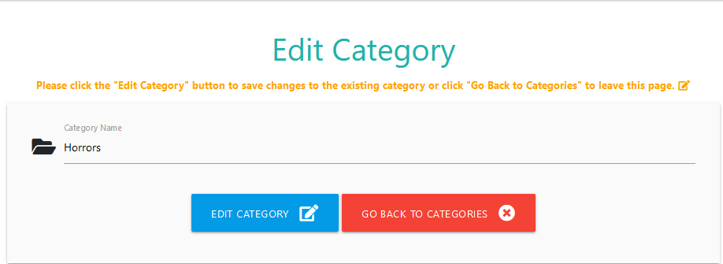

# Milestone-Project-3

<strong>Milestone Project 3</strong>

<strong>Python and Data Centric Development</strong> 

<strong>Code Institute</strong>

<strong>Dolan's Good Books</strong> 

A Book review site where users can add a book to the site,edit a book a user has created and view other users comments and ratings.

The project has a couple of pages:

1:A homepage that allows users to search for a book, and view other books created by users with their comments and ratings.

2:A login page where users can either login or register for an account.

3:A page where a user can add a new book to the site.

4:Page where user can edit a book they have created on the site.

5:Page where the admin of the site can add or edit categories that is used for books.

[Link to website](https://milestone-project-3-book.herokuapp.com/) here to see the website.

## Table of Contents
> - [UX](#ux)
> - [User Stories](#user-stories)
> - [Strategy](#strategy)
> - [Scope](#scope)
> - [Structure](#structure)
> - [Surface](#surface)
> - [Icons](#icons)
> - [Skeleton](#wireframes)
> - [Features](#features)
> - [Features Left to Implement](#features-left-to-implement)
> - [Technologies Used](#technologies-used)
> - [Libraries](#libraries)
> - [Version Control](#version-control)
> - [Other](#other)
> - [Testing](#testing)
> - [Deployment](#deployment)
> - [Credits](#credits)
> - [Acknowledgments](#acknowledgments)

## UX:

## User Stories:
As a User:

"I want to see all the books on this site that users have rated and commented on"

"If there is a book im interested in, i want to learn more about this book and where to go to buy it"

"I want to either create an account or login to the site so that i can add my own book details"

"I want to fill out a form that will allow me to add a book to the site for other users to see"

"I want to fill out a form that will allow me to edit a book i have already created on the site"

As an Admin:

"I want to add a new book category to the site"

"I want to edit a book category on the site"

"I want to delete a category from the site"

## Strategy:
I wanted to create a user friendly website that would have Create,Update,Read and Delete (CRUD) functionality.

## Scope:
I created a database for the website on MongoDB,see below schema

## Structure:
I wanted users to see all the books on the site that have been rated and commented on.

I would then direct them to the Login/Register pages.

After the user has logged in they would now have the option of adding a book to the site.

If the admin has logged in they would now have the option of deleting/editing books,and adding/editing categories.

I also provided my profile links to GitHub and LinkedIn.

## Surface:
I used various text colors to make it stand out against the background.

The orange background footer and red background header was chosen to stand out on the site.

## Icons:
I used Font Awesome for the social media icons of GitHub and LinkedIn,as well as for various icons seen throughout the site.

## Wireframes:
I have included wireframes for each page on this website, click on the below page names to see these wireframes:

[Add Books](wireframes/Dolans_Good_Books_Add_Books.pdf)

[Add Category](wireframes/Dolans_Good_Books_Add_Category.pdf)

[Edit Books](wireframes/Dolans_Good_Books_Edit_Books.pdf)

[Edit Category](wireframes/Dolans_Good_Books_Edit_Category.pdf)

[Homepage](wireframes/Dolans_Good_Books_Homepage.pdf)

[Login](wireframes/Dolans_Good_Books_Login.pdf)

[Manage Categories](wireframes/Dolans_Good_Books_Manage_Categories.pdf)

[Admin Profile](wireframes/Dolans_Good_Books_Profile_Admin.pdf)

[Profile](wireframes/Dolans_Good_Books_Profile.pdf)

[Register](wireframes/Dolans_Good_Books_Register.pdf)
                               
## Features:

<strong>Existing Features:</strong>

<strong>Feature 1:</strong>

<strong>Feature 2:</strong>

<strong>Feature 3:</strong>

<strong>Feature 4:</strong>

<strong>Feature 5:</strong>

## Features Left to Implement:

## Technologies Used:

## Libraries:
[FontAwesome](https://fontawesome.com/)
Used frequently for icons used throughout the website.

[Balsamiq](https://balsamiq.com/wireframes/?gclid=EAIaIQobChMIn-_lgbiJ7QIVn4BQBh1X3Av6EAAYASAAEgL1XfD_BwE)
Used for the creation of wireframes.

## Version Control:
[Github](https://github.com/) - Used to store the code and use of Github Pages to deploy the website. 

[Gitpod](https://gitpod.io/) - Used as the primary version control IDE for development to further push and commit code to Gihub.

## Other:
[Code Institute Course Content](https://courses.codeinstitute.net/) - Primary source of learning code.

[W3Schools](https://www.w3schools.com/) - used as a general resource for CSS and coding tips.

[StackOverFlow](https://stackoverflow.com/) - used as a general resource for layout tips or questions.

[AmIResponsive](http://ami.responsivedesign.is/) - Used to check how the layout of the website looks across different devices. 

## Testing:

<strong>Manual Testing of the site</strong>

<strong>User Stories Testing</strong>

As a User:

""

![])

Expected- 

Result-

<strong>Site Responsiveness</strong>

<strong> HTML Validation</strong>

HTML - [W3C](https://validator.w3.org/) - Markup Validation.

<strong> CSS Validation</strong>

CSS - [W3C](https://jigsaw.w3.org/css-validator/) - CSS Validation.

[Validation Result](https://jigsaw.w3.org/css-validator/validator?uri=https%3A%2F%2Fgithub.com%2FSeanD17%2FMilestone-Project-3%2Fblob%2Fmain%2Fstatic%2Fcss%2Fstyle.css&profile=css3svg&usermedium=all&warning=1&vextwarning=&lang=en)

<strong>JavaScript Validation</strong>

JavaScript - [JSHINT](https://jshint.com/) - JavaScript Validation.

<strong>Project Bugs and Solutions</strong>

<strong>Remaining bugs</strong>

## Deployment:

## Credits:

## Content:
All text content in this website was written by me.

## Media:
The photos used in this site were obtained from:

Bookshelf background gotten on<a href="https://unsplash.com/s/photos/bookshelf?utm_source=unsplash&utm_medium=referral&utm_content=creditCopyText"> Unsplash</a>
  
  
## Acknowledgments:
I received inspiration for this project from my mentor Nishant Kumar.

I also received inspiration from an Bootstrap mini project that was taught to us as part of our course.
